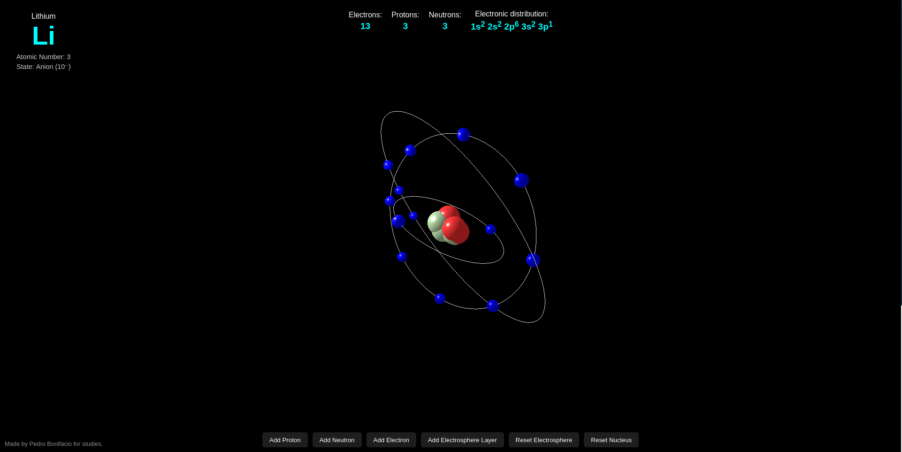

# BOHR ATOM SIMULATOR

A small study project simulating the Bohr Atomic Model. This app shows electron configuration notation, identifies the element (based on the number of protons), and indicates whether it is an ion (cation or anion). The visualization is done in 3D with Three.js, providing an animated representation of the atom.

All theory is based on:
KOTZ, John C.; TREICHEL, Paul; WEAVER, Gabriela C. General Chemistry and Chemical Reactions. São Paulo: Cengage Learning, 2009–2011. 2 volumes.

The project is under development and still being optimized. Some areas may be heavy due to multiple iterations, and feedback or suggestions are very welcome!

You can test it [here](https://gleaming-belekoy-b07107.netlify.app/):  

### Features
* Interactive 3D visualization of Bohr Atomic Model
* Shows electron configuration for elements
* Identifies ions: cation or anion
* Works with custom proton counts
* "Lightweight" (hehe) and educational tool for chemistry study

### Contributing
I’m open to any suggestions for optimization, performance improvements, or new features. Feel free to:
* Fork the repository
* Open issues for bugs or enhancements
* Submit pull requests
Your contribution will be highly appreciated!

### References
* Three.js for 3D visualization: https://threejs.org/
* Chemistry theory: KOTZ, John C.; TREICHEL, Paul; WEAVER, Gabriela C. General Chemistry and Chemical Reactions. São Paulo: Cengage Learning, 2009–2011.